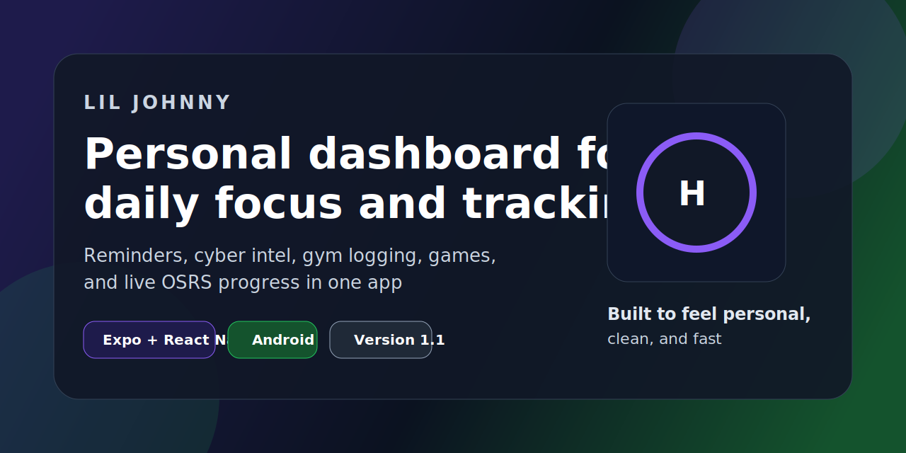

# Lil Johnny

Lil Johnny is a personalized mobile dashboard built with Expo and React Native. It pulls together reminders, cyber intel, gym tracking, gaming feeds, and live OSRS progression into one app that is meant to feel more like a daily operating system than a generic utility bundle.

## Highlights

- Personalized dashboard with time-of-day greeting, daily plan, and focus-aware overview
- Reminder system with real device notifications, recurrence rules, notes, and completion tracking
- Cyber tab with live Reddit intel, CISA KEV fallback handling, and a saved daily threat brief log
- Gym tab with workout logging, progress charts, PR trend snapshots, and estimated 1RM tracking
- Games tab with Reddit-fed gaming news, Pokopia coverage, and a robust OSRS tracker section
- Theme system with `Dark`, `Light`, `Gangsta Green`, and `Silver & Black`

## Preview

Repo social preview art:



## Tech Stack

- Expo
- React Native
- Expo Router
- TypeScript
- EAS Build / EAS Update

## Project Structure

```text
.
|-- app/                    # Expo Router screens and layout
|-- components/             # Reusable UI pieces by feature
|-- context/                # Shared app settings, persistence, notifications
|-- data/                   # Theme data, cyber/game feeds, OSRS tracker, reminders
|-- hooks/                  # Shared screen hooks
|-- assets/images/          # Logos, icons, and startup visuals
|-- scripts/                # Local automation helpers
|-- app.json                # Expo app config
|-- eas.json                # EAS build/update config
`-- README.md
```

## Core Features

### Dashboard

- personalized greeting and daily context
- next reminder awareness
- favorite-focus behavior
- daily plan blocks without surfacing Games as a home-screen focal point

### Reminders

- daily, weekday, or weekend schedules
- native notification support on real builds
- topic notes
- completion tracking and streaks
- wheel-based time picker

### Cyber

- refresh-on-focus intel flow
- live Reddit-based threat signal
- CISA KEV feed support with graceful fallback messaging
- short threat-brief logging for historical context

### Gym

- Push / Pull / Legs workflow
- per-exercise logging for sets, reps, weight, and notes
- recent-entry progress charts
- best-set logic with rep thresholds
- estimated 1RM and PR trend view

### Games

- Nintendo Switch 2 and Steam / PC news
- Pokopia tracking
- embedded OSRS stats and goals
- customizable query defaults from Settings

## Local Development

1. Install dependencies

```bash
npm install
```

2. Start the app locally

```bash
npx expo start
```

3. Run lint

```bash
cmd /c npm run lint
```

## Android Builds

Preview APK build:

```bash
eas build -p android --profile preview
```

Push a JS / asset update to the preview channel:

```bash
eas update --channel preview --message "Describe the change"
```

## Versioning

This project uses semantic-style app versions:

- `1.0.0` -> initial release
- `1.1.0` -> feature release
- `1.1.1` -> patch/fix release

The app version is stored in:

- [`app.json`](./app.json)
- [`package.json`](./package.json)

Because Expo Updates is configured with `runtimeVersion.policy = "appVersion"`, changing the app version also matters for OTA update compatibility.

## GitHub Sync

Manual push:

```bash
git add .
git commit -m "Describe the changes"
git push
```

Daily automatic push from this PC:

- safe sync script: [`scripts/daily-push.ps1`](./scripts/daily-push.ps1)
- task setup helper: [`scripts/setup-daily-push.ps1`](./scripts/setup-daily-push.ps1)

Example:

```powershell
powershell -ExecutionPolicy Bypass -File .\scripts\setup-daily-push.ps1 -Time "19:00"
```

## Notes

- This repo is configured for EAS builds and updates.
- Local caches and generated folders are ignored in Git.
- Some content and branding are intentionally personal.
- The OSRS tracker data source is maintained separately in the OSRS-Daily-Tracker repo.
